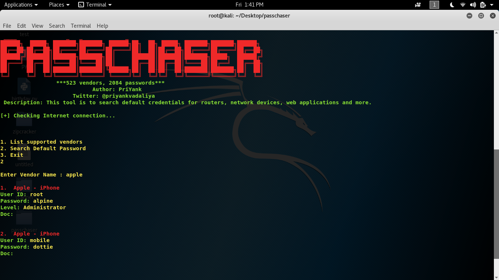

# Passchaser
Passchaser is a simple tool for searching of default credentials for network devices, web applications and more. Search through 523 vendors and their 2084 default passwords.

# Screenshot

# Pre-requisites
Make sure you have installed the following:
<pre>
- Python 3.0 or later.
- pip3 (sudo apt-get install python3-pip)
</pre>

# How to install?
<pre>
git clone https://github.com/priyankvadaliya/Passchaser.git
cd Passchaser
pip3 install -r requirements.txt
python3 Passchaser.py
</pre>

# How do I use this?
- Press 1: This will print the list of supported vendors.
- Press 2: Enter the vendor name and search for default credentials.
- Press 3: To exit from the program.
